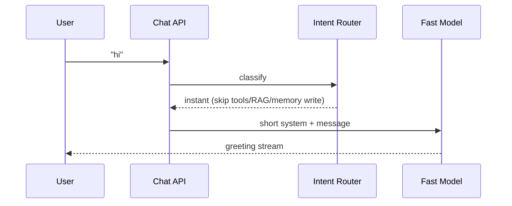
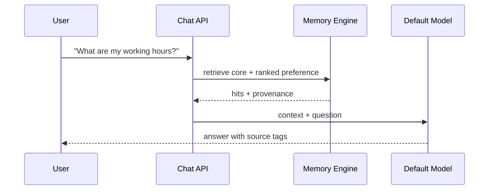
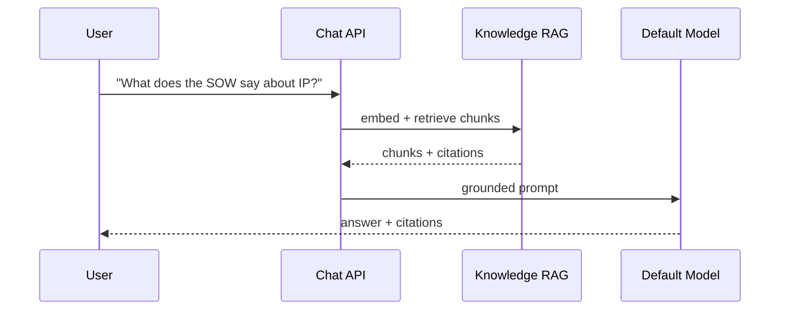
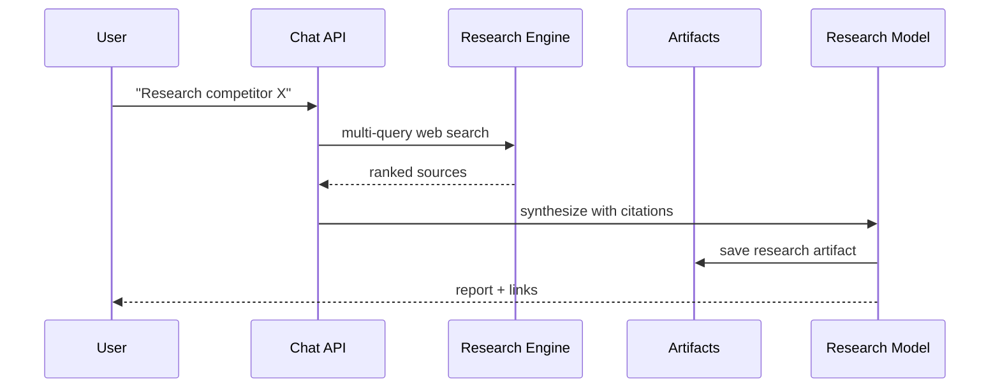
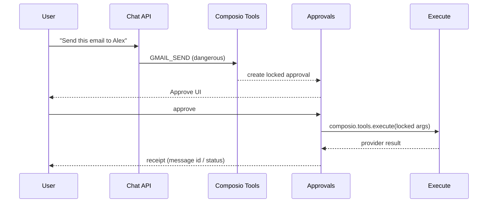
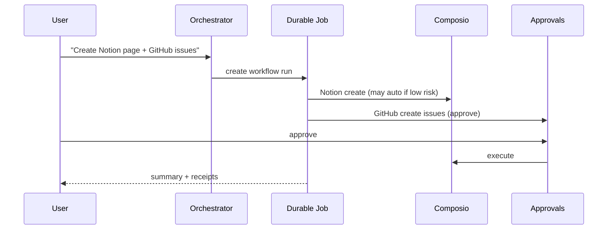
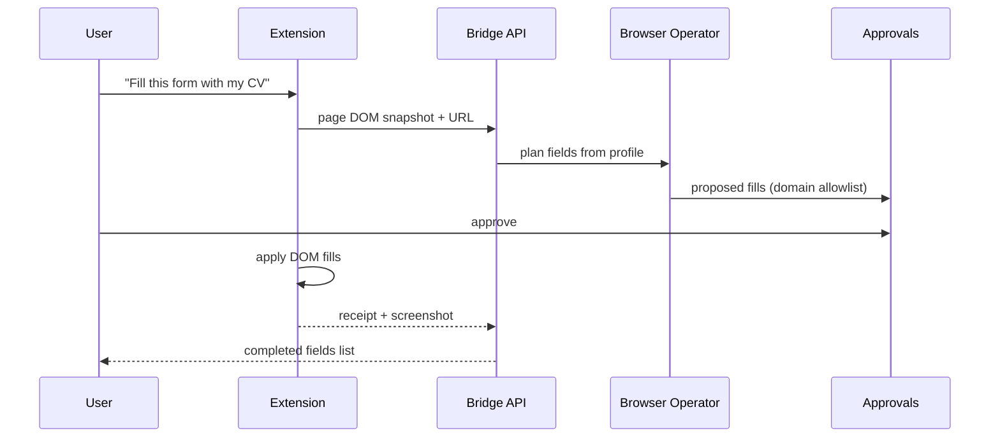
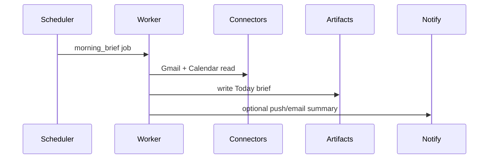
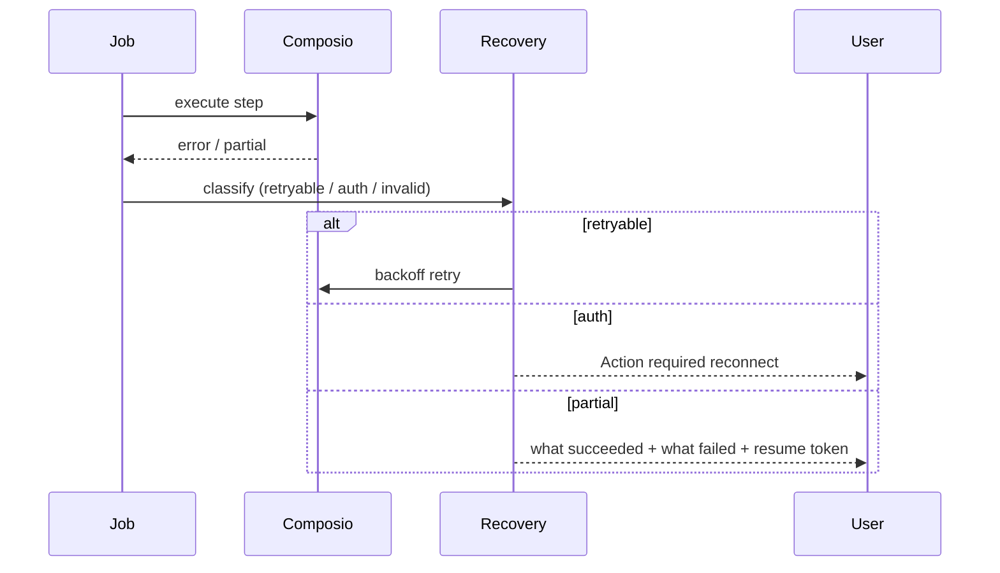
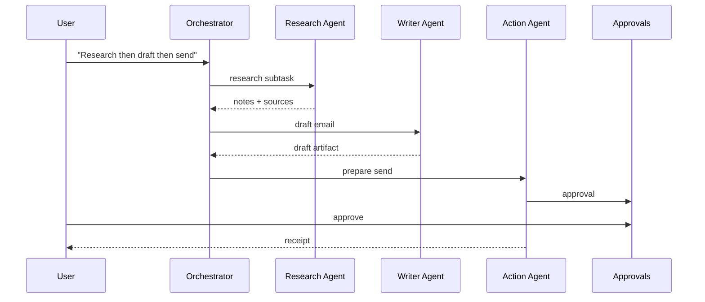

# Aria Target Architecture

**Date:** 2026-07-12  
**Status:** Proposed (research approval required before large implementation)

---

## 1. Design principles

1. **Orchestrator owns the user** — memory, tools, approvals, jobs stay in Aria (Next.js + Supabase).  
2. **Composio owns OAuth and tool execution** — no parallel token stores.  
3. **Intent first** — skip RAG/tools/memory for trivial turns.  
4. **Durable for multi-step** — chat stream for dialogue; jobs for workflows.  
5. **Untrusted external content** — email/web never become trusted instructions.  
6. **Evidence over claims** — no success without provider confirmation.

---

## 2. Component map

```
┌─────────────────────────────────────────────────────────────┐
│                         Clients                              │
│  Web App │ PWA │ Chrome Extension │ Mobile-oriented UI       │
└────────────┬───────────────┬───────────────┬────────────────┘
             │               │               │
             ▼               ▼               ▼
┌────────────────┐  ┌──────────────┐  ┌─────────────────────┐
│ Chat API       │  │ Jobs / Cron  │  │ Extension Bridge API │
│ /api/chat      │  │ Workers      │  │ page context / DOM   │
└───────┬────────┘  └──────┬───────┘  └──────────┬──────────┘
        │                  │                     │
        ▼                  ▼                     ▼
┌─────────────────────────────────────────────────────────────┐
│                    Central Orchestrator                       │
│  Intent Router → Model Router → Context Assembler            │
│  Action Planner → Tool Selector → Approval Engine            │
│  Memory Engine │ Research Engine │ Artifact Engine           │
└───────┬──────────────────┬──────────────────┬───────────────┘
        │                  │                  │
        ▼                  ▼                  ▼
┌──────────────┐  ┌────────────────┐  ┌─────────────────────┐
│ Supabase     │  │ Composio       │  │ Browser Operator      │
│ Postgres+RLS │  │ Session/Tools  │  │ Ext + Playwright pool │
│ pgvector     │  │ OAuth SoT      │  │ Allowlists + receipts │
│ Storage      │  │ Execute        │  └─────────────────────┘
└──────────────┘  └────────────────┘
```

### Subsystems (responsibilities)

| Subsystem | Responsibility |
| --- | --- |
| **Central orchestrator** | Owns turn lifecycle; never lets model invent tool success |
| **Intent router** | instant / personal / knowledge / research / action / complex |
| **Model router** | fast, default, reasoning, research, coding, vision, action |
| **Context assembler** | Core profile + ranked memories + project pack + optional RAG + history hits |
| **Memory engine** | CRUD, contradiction, decay, proposed memories |
| **Conversation-history retrieval** | Embedding/keyword search over past chats; tool-callable |
| **Project context** | Project brief, tasks, decisions, linked knowledge |
| **Knowledge RAG** | Chunk retrieve + citations |
| **Composio session manager** | Stable user UUID → toolkit-scoped tools |
| **Connector registry** | App → toolkit → tools → risk → status |
| **Tool selection** | Intent + connected apps → minimal tool set |
| **Action planner** | Multi-step plan with checkpoints |
| **Approval engine** | Lock args, expiry, invalidate on change, resume execute |
| **Durable execution** | Jobs table / later Temporal for long workflows |
| **Browser operator** | Extension + optional Playwright worker |
| **Extension** | Side panel, content scripts, page snapshots |
| **Background workers** | Ingest, research, CoS overnight, reindex |
| **Scheduler** | Cron for briefs, watches, decay |
| **Event triggers** | Webhooks (mail, calendar) when available |
| **Research engine** | Tavily/Perplexity + source ranking + project writeback |
| **Artifact engine** | Reports, briefs, drafts, plans as first-class objects |
| **Skill registry** | Versioned prompts/workflows with eval + rollback |
| **Audit logs** | Every tool call, approval, browser action |
| **Observability** | Latency, tool error rates, cost per turn |
| **Evaluations** | Golden sets for memory, tools, CoS |
| **Security boundaries** | RLS, allowlists, injection flags, secret isolation |

---

## 3. Data planes

| Plane | Store | Notes |
| --- | --- | --- |
| Auth / identity | Supabase Auth | Stable UUID = Composio user id |
| Conversations | messages, chats | Search index for history retrieval |
| Memory | memories (+ future graph edges) | Suggested → approved |
| Knowledge | documents, chunks, embeddings | Separate from memory |
| Connectors | connections + status | Composio entity linkage |
| Approvals | approvals + locked payload | Resume via execute |
| Jobs | jobs / runs | Durable workflows |
| Artifacts | reports / briefs | Versioned |
| Audit | action_logs | Immutable-ish |
| Browser | receipts, screenshots (Storage) | Retention policy |

---

## 4. Sequence diagrams

### 4.1 Simple greeting



### 4.2 Personal-memory question



### 4.3 Knowledge-base question



### 4.4 Deep research request



### 4.5 Gmail send with approval



### 4.6 Cross-application workflow



### 4.7 Browser form filling



### 4.8 Background scheduled task



### 4.9 Failed tool execution and recovery



### 4.10 Multi-agent delegation



---

## 5. Model routing policy (proposed)

| Class | Use | Avoid |
| --- | --- | --- |
| Fast | greetings, classify, short rewrite | deep reasoning |
| Default | Q&A, memory, drafting | heavy research |
| Reasoning | plans, contradictions, risk | trivial chat |
| Research | web synthesis | tool-only ops |
| Coding | repo/PR | email tone |
| Vision | screenshots / hard UI | text-only |
| Action | tool-arg precision | long essays |

Fallbacks: provider outage → secondary provider same class; never silently drop approval requirements.

---

## 6. Security boundaries

- RLS on all user tables  
- Composio tokens never in Aria DB  
- Browser: domain allowlist + approval for fill/submit  
- Email/web content: untrusted; injection detector on tool args  
- Skills versioned; production changes require eval gate  

---

## 7. Evolution path

| Phase | Architecture move |
| --- | --- |
| Now | Fix Composio chat path; intent; approvals; receipts |
| 30d | Memory V2 + history search + artifacts for briefs |
| 60d | CoS scheduler + inbox triage drafts |
| 90d | Browser operator hybrid + durable multi-app jobs |
| Later | Temporal/LangGraph class durability if jobs outgrow Postgres |

---

*Browser detail: `ARIA_BROWSER_OPERATOR_PLAN.md`. Memory: `ARIA_MEMORY_SYSTEM_V2.md`.*
