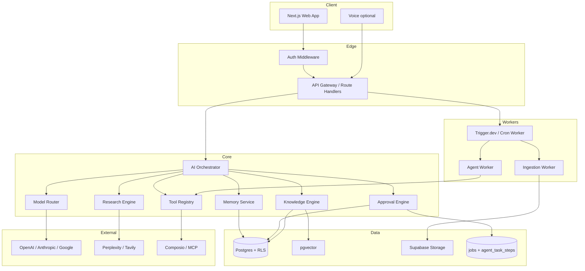
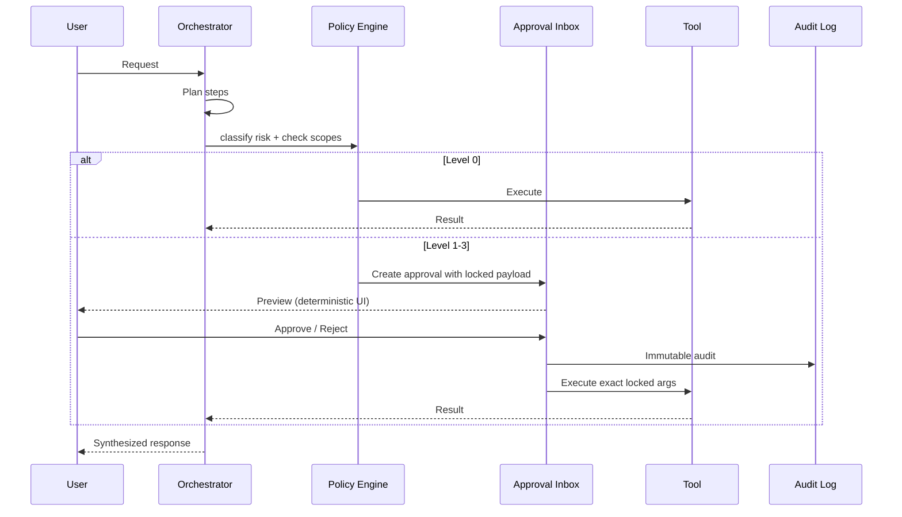
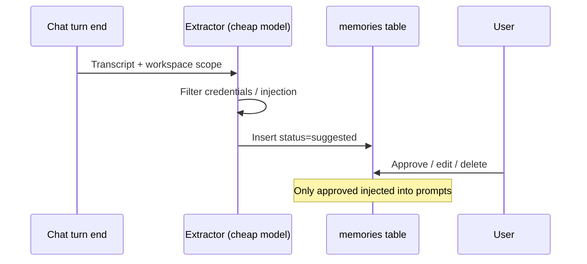

# Aria Master Upgrade Plan

**Access / research date:** 2026-07-10  
**Project:** Aria (local path: `c:\Users\Admin\Desktop\Ai agent`)  
**Classification:** Founder-grade research + engineering audit + implementation plan  
**Status:** Research complete · Audit complete · Implementation not started under this plan

---

## Part 1: Executive summary

### Understanding

Aria is already a **working personal AI workspace** (Next.js 14 + Supabase + multi-provider LLMs), not a greenfield chatbot. It has auth, workspace RLS, RAG with citation validation, memory CRUD, agent risk/approval gates, Composio connectors, admin error logs, and solid docs. The upgrade goal is to turn it into a **secure personal intelligence and execution system** for personal life + multiple businesses — without rebuilding what already works.

### Strongest patterns discovered (evidence-based)

1. **Scaffolding beats model choice.** Successful builders (OpenClaw users on HN, Daniel Miessler’s PAI/LifeOS) converge on: persistent memory files/store, job description / standing goals, tool access, durable process, and a communication channel — not “better prompts alone.”
2. **Memory is a first-class service**, not chat history. Industry standard tiers: episodic / semantic / procedural; user-editable; decay/consolidation; MCP-exposed. Mem0, Graphiti, Letta, and local MCP memory engines all encode this.
3. **Orchestration = state machine + checkpoints + HITL**, not free-form multi-agent chat. LangGraph (and Mastra workflows in TS) win for production; CrewAI for prototypes.
4. **MCP + OAuth tool gateways** (official MCP servers, Composio) are the integration standard. Aria already chose Composio — keep it.
5. **Security assumes prompt injection succeeds.** Contain with least-privilege tools, deterministic policy engines, risk-tiered approvals, payload locking, and audit logs. OWASP agentic risks (goal hijack, tool misuse, memory poisoning, Lies-in-the-Loop) are real in 2026.
6. **Deterministic workflows for money/email/deploy; agents for research/drafting.** Do not let the LLM be the permission system.

### What frequently fails

- Autonomous “AI employees” without durable jobs → silent death on serverless
- Rubber-stamp HITL dialogs (LITL / dialog forging)
- Copying high-star repos (OpenClaw ~382k★) as libraries instead of studying patterns
- Memory without user inspection/deletion → poisoning and privacy debt
- Multi-agent loops without step/time/budget caps
- Claiming “self-improving” without evals, staging, and human approval of prompt/code changes

### What Aria should become

A **workspace-isolated personal OS**: chat + knowledge + memory + approvals + integrations + daily briefing + business workspaces — with a model gateway, durable job runner, stronger memory lifecycle, and production security — **built on the existing Aria codebase**, not a fork of OpenClaw.

### Five most important upgrades

| # | Upgrade | Why |
|---|---------|-----|
| 1 | **Durable background jobs** (Trigger.dev / Inngest / Edge cron) | Ingestion + agent tasks currently fire-and-forget; break on serverless |
| 2 | **Memory lifecycle** (auto-suggest → approve → decay → export/delete) | Schema ready; extraction unwired; competitors treat this as the moat |
| 3 | **Hardened approval UX** (preview payload, no LLM-rendered markdown in approve dialogs) | Mitigate Lies-in-the-Loop; Aria has risk levels but needs payload locking |
| 4 | **Model gateway + routing** (LiteLLM or thin internal router) | Cost/privacy/fallback; avoid single-provider lock-in |
| 5 | **Eval harness** (citation, isolation, injection, approval compliance) | Without evals, “upgrades” are unverifiable |

---

## Part 2: Research methodology

| Item | Detail |
|------|--------|
| **Sources searched** | GitHub (API/pages), official docs, Hacker News, Mem0/Atlan blogs, OWASP, Daniel Miessler PAI/LifeOS, framework comparison articles, local Aria repo |
| **Search terms** | personal AI OS, OpenClaw, Mem0, Letta, LangGraph, CrewAI, MCP, GraphRAG, browser-use, agent security, HITL, PAI, second brain AI, etc. |
| **Date range** | Emphasis on 2025–2026 materials; access date **2026-07-10** |
| **Selection criteria** | Primary sources preferred; maintenance activity; license; fit to Aria’s TS/Next/Supabase stack; security posture |
| **Verification** | GitHub existence + stars/licenses confirmed via API/scrape for listed repos; Aria inventory via full codebase explore |
| **Known limitations** | **No direct X/Twitter API access** in this environment — X findings use HN/secondary mirrors and are labeled. Star counts ≠ quality. Some framework “tier lists” are promotional. |
| **Unavailable** | Live X/Twitter search API; private Discord; paid Product Hunt analytics; running Aria against live Supabase in this session |

---

## Part 3: X/Twitter intelligence report

**Limitation:** Direct X/Twitter scraping was unavailable. Below are **public builder signals** from Hacker News and indexed discussions that mirror the same builder community. Treat as **confirmed HN/primary blog**, not as invented tweets.

### Builder / project signals

| Builder / project | Source | What was built | Architecture / stack | Lessons for Aria | Evidence class |
|-------------------|--------|----------------|----------------------|------------------|----------------|
| **OpenClaw** (Peter Steinberger et al.) | GitHub + HN | Self-hosted personal assistant on messaging channels | TS gateway, multi-channel, skills, local-first | Channels + always-on process matter; do **not** fork into Aria — study gateway/skills pattern | Confirmed product |
| **HN: autonomous offline agent** | [HN 47213594](https://news.ycombinator.com/item?id=47213594) | Agent ran jobs while offline; Telegram summary | OpenClaw + Claude + memory files + cron | Standing job description + durable process + outbound channel | Confirmed user report (self-reported results) |
| **HN: OpenClaw real users** | [HN 46838946](https://news.ycombinator.com/item?id=46838946) | Second-brain / reminders | Markdown memory, Telegram digests | Keep sensitive tools off by default; markdown-inspectable memory wins trust | Confirmed user anecdotes |
| **Memory comparison (ChatGPT/Claude/OpenClaw)** | [HN 47045203](https://news.ycombinator.com/item?id=47045203) | Analysis of memory designs | Summaries vs on-demand search vs local MD+hybrid | Hybrid retrieval + transparency; don’t over-engineer vectors only | Author disclosure: building in space |
| **Daniel Miessler PAI / LifeOS** | [Blog](https://danielmiessler.com/blog/personal-ai-infrastructure) + [LifeOS](https://github.com/danielmiessler/LifeOS) | Personal AI infrastructure | Skills, hooks, memory, orchestration; Claude Code harness | Convergence: skills + hooks + memory + priming — adopt as **patterns**, not wholesale | Confirmed blog + repo |
| **IAI / local MCP memory** | GitHub CodeAbra / PressPlayCollective | Local encrypted memory MCP | Episodic/semantic/procedural; sleep cycles | Local MCP memory is rising; Aria can stay Postgres-first and expose MCP later | Confirmed repos (promotional benchmarks) |

### Recurring X/HN themes (inferred from indexed discussions)

- “Personal AI OS” = gateway + memory + tools + channel, not a prettier chat UI  
- Security skepticism on community skills / always-on agents with email access  
- Markdown-first memory preferred for inspectability  
- Cost control (~$20–200/mo API) dominates solo-founder stacks  

---

## Part 4: GitHub intelligence report

Stars/licenses verified **2026-07-10** unless noted. Reuse: **Adopt** = use as dependency/product; **Adapt** = copy patterns into Aria; **Study** = read only; **Avoid** = do not base core on.

### Curated strongest projects

| Project | Link | Category | What it does | Key tech | Best feature | Weaknesses | Maint. | License | Security | Reuse | Effort |
|---------|------|----------|--------------|----------|--------------|------------|--------|---------|----------|-------|--------|
| OpenClaw | github.com/openclaw/openclaw | Personal AI platform | Self-hosted multi-channel assistant | TS, MCP, channels | Always-on personal agent | Huge issue backlog; not a library | Active | MIT* | Skill/supply-chain risk | Study | High |
| Mem0 | github.com/mem0ai/mem0 | Memory | Universal memory layer | Python/TS, vector+graph | Drop-in memory API | Cloud/OSS feature split | Active | Apache-2.0 | Hosted data trust | Adapt (patterns) / optional Adopt | Med |
| Graphiti | github.com/getzep/graphiti | Memory / KG | Temporal knowledge graphs | Python, graph DBs | Temporal agent context | Ops complexity | Active | Apache-2.0 | Graph PII sprawl | Study → later Adapt | High |
| Letta / letta-code | github.com/letta-ai/letta | Memory agents | Stateful long-horizon agents | Python → TS letta-code | Memory-first runtime | Legacy server shift | Mixed | Apache-2.0 | Persistent state risk | Study | High |
| LangGraph | github.com/langchain-ai/langgraph | Orchestration | Stateful agent graphs | Python, checkpoints | HITL + resume | Python vs Aria TS | Very active | MIT | Graph complexity | Study; mirror patterns in TS | Med |
| Mastra | github.com/mastra-ai/mastra | Orchestration (TS) | TS agents/workflows/evals | TS, MCP | Native TS fit | Dual license `ee/` | Very active | Apache-2.0+ | Review ee/ | Study / selective Adopt | Med |
| CrewAI | github.com/crewAIInc/crewAI | Multi-agent | Role-based crews | Python | Fast prototypes | Less control | Active | MIT | Agency risk | Study only | Low |
| AutoGen | github.com/microsoft/autogen | Multi-agent | Multi-agent programming | Python | Mature patterns | Quieter maintenance (last push ~Apr 2026) | Cooling | MIT | — | Study | Med |
| Browser Use | github.com/browser-use/browser-use | Browser agents | LLM browser control | Python, Playwright | Strong web agent | Flaky; high risk | Active | MIT | Untrusted web = injection | Adapt behind L2/L3 | Med |
| MCP servers | github.com/modelcontextprotocol/servers | MCP | Reference tool servers | TS/Python | Protocol standard | Variable quality | Active | Apache/MIT | Server trust | Adopt selected | Low–Med |
| Composio | github.com/ComposioHQ/composio | Integrations | OAuth tools for agents | TS/Python | 500+ apps | SaaS dependency | Active | MIT | OAuth scope creep | **Adopt (already in Aria)** | Low |
| Vercel AI SDK | github.com/vercel/ai | App SDK | Streaming multi-provider | TS | Best Next.js DX | Aria on v3; migrate carefully | Active | Apache-2.0 | — | **Keep / upgrade** | Med |
| microsoft/graphrag | github.com/microsoft/graphrag | RAG/KG | Graph-indexed RAG | Python | Global summaries | Heavy cost | Active | MIT | Index privacy | Study; not default | High |
| Open WebUI | github.com/open-webui/open-webui | Local UI | Local ChatGPT-like UI | Svelte | Local UX | Custom license | Active | Custom | Self-host ops | Avoid embedding | — |
| n8n | github.com/n8n-io/n8n | Workflows | Visual automation | TS | Ops + AI nodes | Fair-code license | Active | Fair-code | Workflow secrets | Optional ops | Med |
| Ragas | github.com/vibrantlabsai/ragas | Evals | RAG metrics | Python | Faithfulness/relevancy | Agent evals maturing | Active | Apache-2.0 | — | Adopt (CI) | Med |
| DeepEval | github.com/confident-ai/deepeval | Evals | LLM unit tests | Python | pytest-style | Cloud upsell | Active | Apache-2.0 | — | Adopt | Med |
| Trigger.dev | github.com/triggerdotdev/trigger.dev | Jobs | TS background jobs | TS | Fits Next.js | Ops learning | Active | Apache-2.0 | Job secrets | **Adopt recommended** | Med |
| Temporal | github.com/temporalio/temporal | Jobs | Durable workflows | Go+SDKs | Mission-critical durability | Heavy ops | Active | MIT | — | Later if scale | High |
| LiteLLM | github.com/BerriAI/litellm | Model gateway | Multi-model proxy | Python | Unified API | Enterprise license mix | Active | Mixed | Proxy becomes SPOF | Adopt or thin internal | Med |
| LifeOS (PAI) | github.com/danielmiessler/LifeOS | Personal OS | Harness / life OS | TS | Skills/hooks/memory | Opinionated harness | Active | MIT | — | Study | High |

\*OpenClaw LICENSE file reports MIT; GitHub SPDX may show Other — verify before redistribution.

### What Aria should **not** do

- Replace the app with OpenClaw or Open WebUI  
- Add LangGraph as a Python sidecar unless a clear Python worker is introduced  
- Enable browser-use or email-send by default  
- Depend on AutoGen as the core orchestrator  

---

## Part 5: Broader industry research

### Architecture consensus (2026)

| Question | Evidence-based answer |
|----------|----------------------|
| One agent vs many? | **One primary assistant + specialized tools/workflows**; multi-agent only for explicit pipelines (research→draft→critique). Hierarchical supervisor optional later. |
| Deterministic vs agentic? | Ingest, embed, export, billing, permission checks, approvals = **deterministic**. Research, drafting, planning = **agentic**. |
| Separate plan/act/validate? | Yes: plan → permission check → execute → validate → synthesize. Aria’s `runtime.ts` already sketches this. |
| Prevent loops? | Max steps, wall-clock, token budget, cycle detection, no-progress abort. Aria: 25 steps / 4 min — keep and harden. |
| Resume / checkpoint? | Persist step state in DB; durable job runner; approval pauses must serialize **locked payloads**. |
| Personal + business isolation? | Workspace (tenant) + project scopes + RLS + no cross-workspace retrieval. Aria has this — extend to multi-business workspaces UX. |
| Event-driven? | **Combination:** request/response for chat; **job queue** for ingest/agents; optional webhooks for integrations. |

### Models & routing (practical)

| Task | Prefer | Notes |
|------|--------|-------|
| Coding / planning | Claude Opus/Sonnet class, GPT frontier | Premium |
| Research synthesis | Frontier + grounded search (Perplexity/Tavily) | Cite sources |
| Extraction / classify | Small/cheap models | Cost control |
| Embeddings | `text-embedding-3-small` (current) | Keep dim 1536 |
| Voice STT/TTS | Deepgram / Whisper / ElevenLabs | Opt-in |
| Local/privacy | Local models via gateway when configured | Fallback path |
| Validation | Second-pass cheap model or deterministic validators | Citations already deterministic |

### Memory consensus

Hybrid store: **Postgres (source of truth) + vectors + optional graph later**. Types: preference, episodic summaries, project facts, procedural workflows, CRM relations. User must inspect/edit/delete. Score by recency × importance × reinforcement. Prevent poisoning: never auto-approve memories from untrusted retrieved content.

### Security consensus

Assume injection. Least privilege. Risk tiers. HMAC/lock approved tool args. Sanitize HITL UI (no LLM markdown in approval cards). Redact secrets before external models. Audit everything consequential.

---

## Part 6: Existing-project audit (Aria)

### Architecture inventory

| Area | Current state | Evidence |
|------|---------------|----------|
| Frontend | Next.js App Router, Tailwind, sidebar app shell | `app/(app)/*`, `components/` |
| Backend | Route handlers (no Server Actions) | `app/api/*` (~25 routes) |
| DB | Supabase Postgres + RLS + pgvector | `supabase/migrations/` |
| Auth | Supabase email/password + middleware | `middleware.ts`, `lib/auth/guards.ts` |
| Memory | CRUD + approved injection; no auto-extract | `lib/ai/memory.ts`, `/memory` |
| Knowledge | Upload → extract → chunk → embed → RAG | `lib/ingestion/*`, `lib/ai/rag.ts` |
| Agents | Pipelines + task runtime + risk 0–4 | `lib/agent/*`, `lib/ai/agents.ts` |
| Tools | Registry; web_search live; others stubbed | `lib/ai/tools.ts` |
| Integrations | Composio OAuth + email triage/action | `lib/connectors/composio.ts` |
| Jobs | `jobs` table; **no worker** | migrations + `startTaskInBackground` |
| Admin | Error logs, resolve | `/admin`, `/api/admin/errors` |
| Logging | Sanitized error + audit | `lib/logging/error-log.ts` |
| Tests | Vitest unit; Playwright installed, no e2e | `tests/unit.test.ts` |
| Deploy | No Docker/CI committed | — |
| Docs | Strong | README, SECURITY, ARCHITECTURE, MVP_CHECKLIST |

### Feature status

**Complete (preserve):** Auth, RLS workspaces, projects, streaming chat (6 modes), RAG+citation validation, memory CRUD, reports+PDF, approvals inbox, agent risk classification, Composio framework, contacts CRM, admin errors, sanitization, AppError UX.

**Partial / needs improvement:** Rate limits (not on all routes), research (needs keys), Composio tool execution (untested broadly), voice (browser only), training logs (write-only), inline ingestion, fire-and-forget agents, AI SDK v3 age, model ID freshness.

**Missing:** Durable workers, auto-memory suggestions, hybrid BM25+vector, knowledge graph, calendar/email daily briefing product surface, multi-business UX, eval harness, e2e, observability (Sentry/Langfuse), MCP client gateway, browser automation, retention policies, DB admin roles.

**Security / privacy issues:** In-memory rate limiter; `ADMIN_EMAIL` env-only; `llm_training_logs` full prompts without TTL; serverless task loss; approval dialogs need payload-lock review (LITL).

**Vendor lock-in / cost:** OpenAI embeddings default; Composio for connectors; multi-LLM already abstracted in `providers.ts` (good).

---

## Part 7: Gap analysis

| Area | Current | Desired | Evidence | Risk | Change | Priority | Effort | Class |
|------|---------|---------|----------|------|--------|----------|--------|-------|
| Background jobs | Fire-and-forget | Durable queue + retries | `runtime.ts`, REMAINING_TASKS | High reliability | Trigger.dev/Inngest + jobs table | P0 | M | Confirmed req |
| Rate limiting | Partial in-memory | Redis/Postgres, all expensive routes | `rate-limit.ts` | Abuse/cost | Apply + persist | P0 | S | Confirmed req |
| Training log retention | Unlimited prompts | TTL + redaction + opt-in | `0006_training_logs.sql` | Privacy | Retention job + settings | P0 | S | Confirmed req |
| Approval payload lock | Risk text heuristics | Lock args; non-LLM UI preview | `risk.ts`, OWASP LITL | High | HMAC/hash approved payload | P0 | M | Strong evidence |
| Memory auto-suggest | Schema only | Extract→suggested→approve | MEMORY docs | Product | Post-chat extractor | P1 | M | Confirmed req |
| Model gateway | Direct SDK | Router + fallback + budgets | `providers.ts` | Cost/lock-in | Extend providers + budgets | P1 | M | Strong evidence |
| Hybrid retrieval | Vector only | Vector + tsvector fusion | REMAINING_TASKS | Quality | Add tsvector | P1 | M | Strong evidence |
| Eval harness | Unit only | Golden + adversarial | MVP_CHECKLIST | Quality | Ragas/DeepEval or TS suite | P1 | M | Confirmed req |
| Daily briefing | Missing | Calendar+email+tasks digest | Vision | Product | Cowork + Composio | P2 | L | Confirmed req |
| Multi-business UX | Single personal WS | Named business workspaces | Schema supports members | Leakage if weak UX | Workspace switcher + labels | P2 | M | Confirmed req |
| MCP gateway | Stubs | Opt-in MCP client | tools.ts | Supply chain | Allowlist servers | P2 | M | Strong evidence |
| Observability | Console + DB | Traces + cost | REMAINING_TASKS | Ops | Langfuse/Sentry flags | P2 | M | Strong evidence |
| Knowledge graph | None | Optional entities/links | Industry Graphiti/GraphRAG | Complexity | Defer until RAG strong | P3 | L | Experimental |
| Browser agent | Stub | Sandboxed Playwright | browser-use | Security | L2/L3 only | P3 | L | Strong evidence |
| Voice realtime | Stubs | STT/TTS providers | voice/* | Cost | Opt-in keys | P3 | M | Reasonable |
| Self-modifying code | N/A | **Never auto** | Security rules | Critical | Proposals only + staging | P0 policy | — | Confirmed req |

---

## Part 8: Target product specification

Aria becomes a **Personal Intelligence Environment** with:

1. **Home / Today** — briefing, approvals due, follow-ups, system health (user-safe)  
2. **Chat** — modes, citations, tool transparency, attachments  
3. **Knowledge** — ingest, preview, chunk inspector, hybrid search  
4. **Memory** — typed, editable, exportable, approval-gated suggestions  
5. **Projects & Businesses** — isolated workspaces; no cross-tenant RAG  
6. **Tasks & Agents** — planned steps, checkpoints, budgets  
7. **Approvals** — risk-tiered, payload preview, immutable audit  
8. **Integrations** — Composio + allowlisted MCP; opt-in per workspace  
9. **Contacts / CRM** — personal + per-business  
10. **Reports / Files** — branded exports, version history  
11. **Settings / Privacy** — retention, model routing, consent  
12. **Admin** — health, errors, cost, queues; **no default content access**

Safety levels 0–3 as specified in the master prompt (map Aria’s 0–4 by treating 4 as hard block).

---

## Part 9: Target architecture

### Principles

- Keep **modular monolith** (Next.js + Supabase). Add workers, not microservices.  
- Postgres is system of record; vectors in pgvector; object storage for files.  
- Model calls only through `lib/ai/providers.ts` (+ optional LiteLLM).  
- Tools only through registry + permission + approval policy.  
- Untrusted content never becomes executable policy.

### Mermaid — system architecture



### Mermaid — tool execution sequence



### Mermaid — memory write



### Recommended stack (stay close to Aria)

| Layer | Choice | Alternative |
|-------|--------|-------------|
| App | Next.js 14→15 + AI SDK 4/5 | Mastra for new agent modules |
| DB | Supabase Postgres + pgvector | Neon + pgvector |
| Auth | Supabase Auth | Clerk (more lock-in) |
| Jobs | **Trigger.dev** | Inngest; Temporal later |
| Memory | Enhance Aria tables (+ optional Mem0 later) | Graphiti when KG justified |
| Tools | Composio + MCP allowlist | Direct OAuth per app |
| Gateway | Extend `providers.ts`; LiteLLM if multi-service | OpenRouter |
| Evals | Vitest + DeepEval/Ragas scripts | Braintrust platform |
| Obs | Sentry + Langfuse (flags) | Helicone |

### Staged migration

1. Stabilize P0 (jobs, rate limits, retention, approval lock)  
2. Memory + hybrid retrieval  
3. Orchestrator hardening (budgets, checkpoints)  
4. Personal assistant surfaces (Today, email/calendar read)  
5. Business workspaces  
6. Dev assistant (GitHub via Composio)  
7. Voice / browser (opt-in)  
8. Eval + cost optimization loop  

---

## Part 10: Security and privacy plan

1. **Tool permissions:** registry scopes per workspace; default deny; dangerous flag + risk level.  
2. **Destructive actions:** Level 2–3 require approval; Level 3 step-up reauth.  
3. **Credentials:** Supabase vault / env only; Composio holds OAuth; never in memories.  
4. **Prompt injection:** treat retrieved docs/emails/web as data; strip instruction-like payloads where feasible; never elevate privileges from content.  
5. **Browser sandbox:** isolated profile, no personal cookies by default, network allowlist, L2+.  
6. **Code execution:** container/sandbox only; no host FS write.  
7. **Email/pay/deploy:** never auto; standing rules must be narrowly scoped and auditable.  
8. **Audit logs:** who/what/when/workspace/trace; immutable for approvals.  
9. **Tenant isolation:** RLS + app filters; tests for cross-workspace leakage.  
10. **Retention:** user-configurable; training logs opt-in + TTL.  
11. **Backups:** encrypted Supabase backups; tested restore.  
12. **Plugins/MCP:** allowlist, version pin, review checklist.  
13. **Supply chain:** pin deps, audit new packages, prefer maintained licenses.  
14. **Redaction:** sanitize before logs and before sending to external models when policy says so.  
15. **Admin:** metadata only; break-glass access time-limited + logged.  
16. **No self-modifying production code** without human PR + CI.

---

## Part 11: UX specification (condensed)

- **Shell:** sidebar + mobile nav + command bar (add) + workspace switcher.  
- **Chat:** streaming, citations, tool trace drawer, approval deep-links.  
- **Approvals:** show exact action, destination, diff/payload, risk badge — **no agent-authored markdown**.  
- **Errors:** human message, what failed, whether state changed, retry, trace id.  
- **Never show:** raw HTML, stacks, provider dumps, secrets.  
- **Themes:** keep existing light/dark.  
- **Daily usefulness:** Today briefing, Approvals inbox, forgotten follow-ups, project context — not demo-only multi-agent theater.

---

## Part 12: Implementation roadmap

### Phase 0 — Discovery & stabilization
- Objectives: verify build/tests; no secrets in git; baseline metrics  
- Acceptance: `npm test` + `typecheck` green; `.env.example` accurate  
- Difficulty: S  

### Phase 1 — Secure foundation (P0)
- Durable jobs; rate limits; training-log TTL; approval payload lock; apply rate limits to chat/upload/research/ingest  
- Tests: unit for policy lock; integration for job retry  
- Rollback: feature flags off  

### Phase 2 — Knowledge & memory (P1)
- Auto-suggest memories; hybrid retrieval; signed URL preview; retention UI  
- Tests: memory approval injection; retrieval relevance fixtures  

### Phase 3 — Orchestration (P1)
- Budgets, checkpoints, model routing, eval harness v1  
- Tests: loop limits; fallback models  

### Phase 4 — Personal assistant (P2)
- Today view; Gmail/Calendar read via Composio; tasks/follow-ups  
- Security: read-only scopes first  

### Phase 5 — Business assistant (P2)
- Multi-workspace UX; client/project reports; CRM depth  
- Tests: isolation e2e  

### Phase 6 — Developer assistant (P2)
- GitHub tools; PR review workflows; test runner in sandbox  

### Phase 7 — Voice / desktop / browser (P3)
- Provider voice; browser-use behind L2/L3  

### Phase 8 — Optimization (P2–P3)
- Cost dashboards; regression evals; prompt versioning with human approve  

---

## Part 13: Master TODO checklist

### P0 — Security & reliability
- [x] **Durable job runner for ingest + agent tasks**  
  - Purpose: survive serverless; retries  
  - Status: jobs table enqueue + inline kick + `/api/jobs/drain`  
  - Evidence: `lib/jobs/enqueue.ts`, `app/api/jobs/drain/route.ts`, upload/ingest/task run wired  
  - Acceptance: job rows created; `JOBS_INLINE=false` + drain resumes work  
  - Tests: unit suite green (payload lock + rate limit); typecheck  
  - Risks: multi-instance still needs Redis rate limits + external worker (Trigger.dev next)  
  - Compromise: inline kick remains default for single-node; Trigger.dev not installed yet  

- [x] **Rate-limit all expensive routes**  
  - Purpose: cost/abuse control  
  - Status: chat/upload/research/taskRun/email already; **ingest + jobs** added  
  - Evidence: `lib/security/rate-limit.ts`, `app/api/ingest/route.ts`, `app/api/jobs/drain/route.ts`  
  - Acceptance: 429 with friendly message  

- [x] **Training log retention + opt-in**  
  - Purpose: privacy  
  - Status: writes gated by `LLM_TRAINING_LOGS_ENABLED` (default false); TTL script  
  - Evidence: `app/api/chat/route.ts`, `lib/env.ts`, `scripts/cleanup-training-logs.js`, `.env.example`  

- [x] **Approval payload locking + LITL-safe UI**  
  - Purpose: prevent dialog forging / arg mutation  
  - Status: canonical JSON + sha256 at gate; verify at execute; UI shows structured fields + hash prefix  
  - Evidence: `lib/agent/payload-lock.ts`, `lib/agent/runtime.ts`, migration `0010`, `components/approvals/approvals-client.tsx`, `tests/payload-lock.test.ts`  

- [x] **Policy: no autonomous production code mutation**  
  - Purpose: controlled improvement only  
  - Status: documented in MASTER_UPGRADE_PLAN; not implemented as a feature (by design)  

### P1 — Core architecture / knowledge / tools
- [x] Auto-memory suggestions post-chat  
- [x] Hybrid BM25 + vector retrieval  
- [x] Model routing budgets + fallbacks  
- [x] Eval harness (citations, isolation, injection) — unit eval suite in `tests/eval-p1.test.ts`  
- [x] Signed-URL document preview  
- [ ] Checkpoint resume for agent_tasks (partial via jobs; deeper step checkpoints later)  

### P2 — Personal / business / UX / admin
- [ ] Today / daily briefing  
- [ ] Workspace switcher for businesses  
- [ ] Conversation search in sidebar  
- [ ] Cost & queue panels in admin (redacted)  
- [ ] Langfuse/Sentry behind flags  
- [ ] Gmail/Calendar read integrations (opt-in)  

### P3 — Advanced
- [ ] Allowlisted MCP client  
- [ ] Browser automation sandbox  
- [ ] Voice provider wiring  

### P4 — Experiments
- [ ] Graphiti/GraphRAG pilot on one corpus  
- [ ] Local model path via gateway  

---

## Part 14: Testing and evaluation plan

| Suite | What | Min bar for prod |
|-------|------|------------------|
| Unit | chunk, sanitize, risk, citations, rate limit | 100% pass existing + new |
| Integration | upload→ingest→match RPC | Happy path green |
| E2E Playwright | signup→project→upload→cite→export | Critical path green |
| Security | cross-workspace RAG denied; injection cannot send email | 0 failures |
| Approval | L2/L3 blocked without approve; payload lock | 0 bypasses |
| RAG eval | faithfulness/citation accuracy on fixtures | ≥0.8 citation precision |
| Load | chat 30 rpm/user enforced | No cascade failure |
| Visual | key pages | No raw error dumps |

---

## Part 15: Cost analysis (estimates, labeled)

**Assumptions:** 1 power user; ~100 chat turns/day; ~20 docs/month; research 20×/day; embeddings on ingest; US region.

### Plan A — Personal low-cost (~$25–80/mo)
- Supabase Pro or free tier → Pro when needed (~$25)  
- OpenAI embeddings + 1 frontier model mixed with cheap (~$15–40)  
- Perplexity/Tavily (~$0–20)  
- No browser agent; Composio free tier  
- **Privacy:** cloud LLMs see prompts; RLS local to your project  

### Plan B — Growing business (~$150–400/mo)
- Supabase Pro + storage  
- Multi-model + LiteLLM  
- Trigger.dev  
- Composio paid  
- Langfuse  
- Occasional browser jobs  

### Plan C — Production multi-workspace (~$500–2,000+/mo)
- Dedicated Supabase / compute  
- Temporal or larger workers  
- Separate embedding + rerank  
- Observability + backups + support  
- Strict retention and DPA with vendors  

*Estimates only; actuals depend on tokens and research volume.*

---

## Part 16: Immediate implementation actions

1. Create branch `upgrade/p0-foundation` (when coding starts).  
2. Wire rate limits on `/api/chat`, `/api/upload`, `/api/research`, `/api/ingest`, task run.  
3. Add retention flag for `llm_training_logs`.  
4. Design Trigger.dev (or cron) worker calling `ingestDocument` + `runTask`.  
5. Add approval payload hash columns + execute-time verify.  
6. Add golden fixture eval script for citations.  
7. Do **not** enable browser or send-email defaults.

---

## Part 17: Coding-agent prompts

### A) OpenAI Codex prompt

```text
You are upgrading Aria, a Next.js 14 + Supabase personal AI app at the repo root.

CONTEXT
- Preserve working features: auth, RLS workspaces, chat modes, RAG+validateCitations, memory CRUD, approvals, agent risk levels, Composio, admin error logs.
- Read first: README.md, ARCHITECTURE.md, SECURITY.md, MVP_CHECKLIST.md, REMAINING_TASKS.md, docs/MASTER_UPGRADE_PLAN.md, lib/agent/runtime.ts, lib/agent/risk.ts, lib/ai/tools.ts, lib/security/rate-limit.ts, supabase/migrations/*.sql.

GOAL (P0 only this session)
1) Apply rate limiting to expensive API routes.
2) Add opt-in + TTL retention for llm_training_logs.
3) Implement approval payload locking (hash/canonicalize tool args; verify at execute; approval UI must not render LLM markdown as trusted HTML).
4) Introduce a durable job enqueue interface (even if worker is stubbed behind env) replacing void runTask fire-and-forget for ingest/agent tasks.
5) Add/extend unit tests; run npm test and npm run typecheck.

CONSTRAINTS
- No secrets in code. No enabling gmail_send/browser by default.
- Do not replace the stack with OpenClaw/LangGraph.
- Prefer incremental changes; update docs/MASTER_UPGRADE_PLAN.md checkboxes with evidence.
- Report: files changed, tests run, remaining risks, rollback notes.
```

### B) Claude Code prompt

```text
# Aria P0 hardening

## Project
Next.js App Router personal AI (Aria). Stack: Supabase Auth/RLS/pgvector, Vercel AI SDK, Composio, Vitest.

## Do not break
Streaming chat, RAG citations, memory CRUD, approval inbox, RLS isolation, admin sanitization.

## Inspect
docs/MASTER_UPGRADE_PLAN.md, lib/agent/*, lib/ai/providers.ts, lib/ai/memory.ts, lib/ingestion/pipeline.ts, app/api/**/route.ts, SECURITY.md

## Implement in order
1. Rate limits on chat/upload/research/ingest/agent run APIs using lib/security/rate-limit.ts (improve persistence if feasible without Redis).
2. llm_training_logs: gate writes on env/user setting; document retention; add cleanup SQL or script.
3. Approvals: store canonical JSON + sha256 of executable payload; execute path refuses mismatch; UI shows structured fields only.
4. Jobs: create lib/jobs/enqueue.ts; persist jobs rows; startTaskInBackground and ingest should enqueue; document Trigger.dev wiring as next step if not fully connected.
5. Tests for risk classification + payload lock + rate limit behavior.
6. Run npm test && npm run typecheck.

## Security rules
Assume prompt injection. Never let retrieved content bypass approval. No autonomous code self-modification.

## Done when
Checklist items in MASTER_UPGRADE_PLAN P0 are [x] with file evidence and test output pasted in the final report.
```

---

## Appendix: Research Q&A short answers

See Parts 5 and 9 for architecture/models/memory/tools/security/UX/self-improvement. Self-improvement allowed only as: feedback → eval datasets → human-approved prompt/workflow PRs → staging → rollback. Not autonomous production mutation.

---

*End of master plan. Interactive summary canvas: see Cursor canvases folder `aria-upgrade-plan.canvas.tsx`.*
